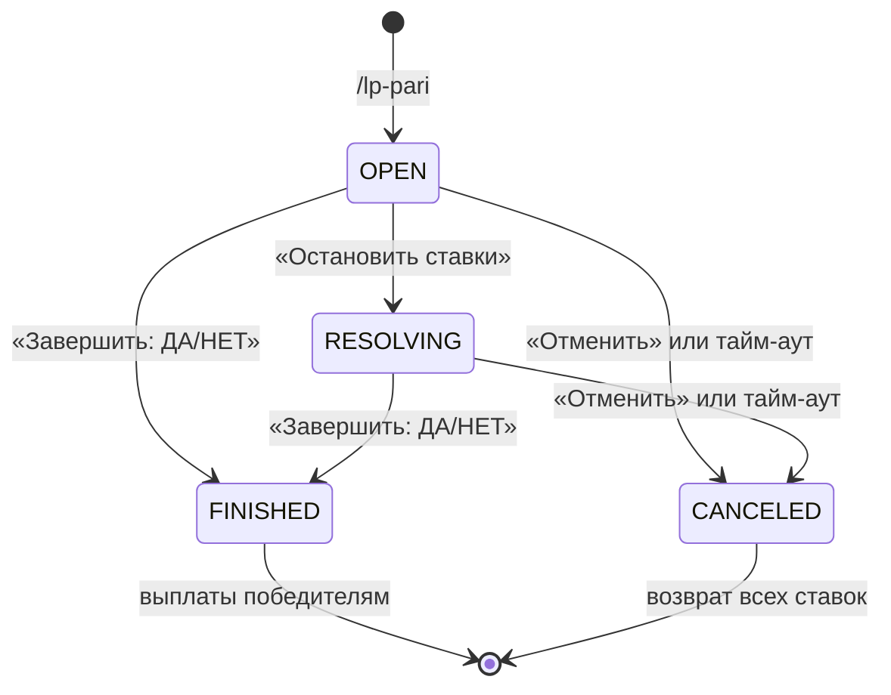

# Пари (Twitch Predictions)

Механика пользовательских пари: автор создает событие, участники ставят LP на исход
«Да» или «Нет», после объявления итога победители получают выплату с коэффициентом 2.0.

## Роли

| Роль | Что может |
|---|---|
| **Автор** | Создает пари, останавливает прием ставок, объявляет исход, отменяет пари. **Не может ставить в собственном пари.** |
| **Участник** | Делает одну ставку на один вариант. Изменить выбор или поставить на оба исхода нельзя. |

## Жизненный цикл

- **OPEN** — идет прием ставок;
- **RESOLVING** — прием ставок остановлен, исход еще не объявлен (необязательный шаг);
- **FINISHED** — исход объявлен, победителям начисляется выигрыш;
- **CANCELED** — пари аннулировано, ставки возвращаются полностью.

`FINISHED` и `CANCELED` — терминальные статусы: вернуться из них нельзя.

## Интерфейс

`/lp-pari <название>` публикует сообщение-опрос: заголовок, автор, количество ставок и
размер пула по каждому варианту, статус в футере. Цвет эмбеда меняется вместе со статусом.

Ряд кнопок для участников:

| Кнопка | `customId` | Активна |
|---|---|---|
| Да | `pari:bet:<id>:yes` | только в статусе OPEN |
| Нет | `pari:bet:<id>:no` | только в статусе OPEN |

Ряд управления (виден, пока пари не в терминальном статусе; нажатие проверяется на авторство):

| Кнопка | `customId` |
|---|---|
| ⏸ Остановить ставки | `pari:stop:<id>` |
| Завершить: ДА | `pari:finish:<id>:yes` |
| Завершить: НЕТ | `pari:finish:<id>:no` |
| 🚫 Отменить | `pari:cancel:<id>` |

Клик по «Да»/«Нет» открывает модальное окно с полем суммы. Допускаются целые числа
от 1 до 100 000 000 LP; пробелы и подчеркивания в введенной сумме игнорируются.

Координаты опубликованного сообщения (`channel_id`, `message_id`) сохраняются в пари,
чтобы бот мог перерисовать опрос из планировщика — например после отмены по тайм-ауту.

## Экономика

| Событие | Движение средств | Транзакция |
|---|---|---|
| Ставка принята | `balance -= amount` | `BET_HOLD` (`-amount`) |
| Выигрыш | `balance += amount * 2` | `BET_WIN` (`+amount * 2`) |
| Проигрыш | 0 | нет записи |
| Отмена пари | `balance += amount` | `BET_REFUND` (`+amount`) |

У всех транзакций пари `reference_id` равен id пари, что позволяет собрать полную историю
по конкретному событию.

> **Важно об эмиссии.** В отличие от оригинальных Twitch Predictions, где выигрыш делится
> из пула проигравших, жесткий множитель x2 не гарантирует нулевую сумму: если большинство
> поставит на верный исход, суммарный баланс участников вырастет. Это заложено в задании
> и является сознательным свойством механики, а не ошибкой расчета.

## Конкурентный доступ

Прием ставки (`PariService.placeBet`) — одна транзакция со следующим порядком действий:

1. `SELECT ... FOR UPDATE` строки пари — пока идет прием ставки, статус не изменится
   (кнопка «Завершить» подождет);
2. проверки: та же гильдия, статус `OPEN`, вызывающий не автор;
3. `SELECT ... FOR UPDATE` строки баланса участника;
4. **только после захвата блокировки** — проверка, что ставки от этого участника еще нет,
   и что баланса хватает;
5. списание, запись `PariBet` и транзакции `BET_HOLD`.

Порядок шагов 3 и 4 принципиален. Если проверять существующую ставку до блокировки, два
одновременных клика успели бы оба увидеть «ставки нет» и пройти дальше. Блокировки всегда
берутся в одном порядке (пари → баланс), поэтому взаимных блокировок не возникает.

Последний рубеж — уникальный индекс `(pari_id, member_id)` в `pari_bets`: нарушение
перехватывается и превращается в понятное сообщение пользователю. Уход баланса в минус
дополнительно закрыт ограничением `CHECK (balance >= 0)` на `guild_members`.

## Идемпотентность расчета

Объявление исхода и выплаты разделены:

1. `PariService.finish` / `cancel` только фиксируют статус и победивший вариант;
2. `PariSettlementService.settle` перебирает нерассчитанные ставки порциями по 200;
3. `PariPayoutProcessor.settleBet` рассчитывает **одну** ставку в **своей** транзакции:
   блокирует строку ставки, выходит, если флаг `settled` уже стоит, иначе начисляет выплату
   и ставит флаг — начисление и флаг коммитятся вместе.

Отсюда свойства:

- **повторный запуск безопасен** — уже рассчитанные ставки пропускаются по флагу `settled`;
- **сбой на одном участнике не откатывает остальных** — каждая ставка в своей транзакции;
- **расчет переживает рестарт** — пока остается хоть одна ставка с `settled = false`,
  поле `paris.settled_at` не заполняется, и планировщик `recoverPendingSettlements`
  (раз в 60 с) подбирает такое пари и доводит выплаты до конца.

Если за проход не удалось рассчитать ни одной ставки (например, БД недоступна), `settle`
прекращает цикл, чтобы не крутиться вхолостую, и оставляет пари планировщику.

## Тайм-аут

`cancelTimedOutParis` раз в 60 секунд отменяет пари в статусах `OPEN` и `RESOLVING`,
созданные раньше чем `PARI_TIMEOUT_HOURS` часов назад (по умолчанию 24), с полным возвратом
ставок. Значение `0` отключает тайм-аут.

## Ограничения

- Название пари обрезается до 200 символов; в заголовке модального окна — до 45
  (ограничение Discord).
- Максимальная ставка — 100 000 000 LP: выплата (ставка × 2) должна умещаться в
  `points_transactions.amount` типа `INTEGER`.
- Один участник — одна ставка на пари.
