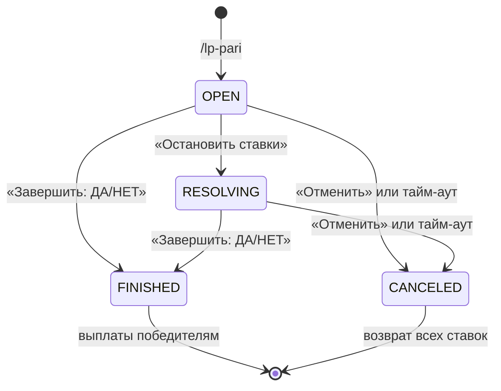

# Пари (Twitch Predictions)

Механика пользовательских пари: автор создает событие, участники ставят LP на исход
«Да» или «Нет», после объявления итога призовой фонд делится между победителями
пропорционально их ставкам. Выплата определяется коэффициентом, который считается
по тотализаторной схеме и меняется с каждой новой ставкой.

## Роли

| Роль | Что может |
|---|---|
| **Автор** | Создает пари, останавливает прием ставок, объявляет исход, отменяет пари. **Не может ставить в собственном пари.** |
| **Участник** | Делает одну ставку на один вариант. Изменить выбор или поставить на оба исхода нельзя. |

## Жизненный цикл



- **OPEN** — идет прием ставок;
- **RESOLVING** — прием ставок остановлен, исход еще не объявлен (необязательный шаг);
- **FINISHED** — исход объявлен, победителям начисляется выигрыш;
- **CANCELED** — пари аннулировано, ставки возвращаются полностью.

`FINISHED` и `CANCELED` — терминальные статусы: вернуться из них нельзя.

## Интерфейс

`/lp-pari <название>` публикует сообщение-опрос: заголовок, автор, количество ставок,
размер пула и текущий коэффициент по каждому варианту, размер удерживаемой комиссии и статус
в футере. Цвет эмбеда меняется вместе со статусом. У завершенного пари в футере показывается
итоговый коэффициент.

Ряд кнопок для участников:

| Кнопка | `customId` | Активна |
|---|---|---|
| Да | `pari:bet:<id>:yes` | только в статусе OPEN |
| Нет | `pari:bet:<id>:no` | только в статусе OPEN |

Ряд управления (виден, пока пари не в терминальном статусе; нажатие проверяется на авторство):

| Кнопка | `customId` |
|---|---|
| ⏸ Остановить ставки | `pari:stop:<id>` |
| Завершить: ДА | `pari:finish:<id>:yes` |
| Завершить: НЕТ | `pari:finish:<id>:no` |
| 🚫 Отменить | `pari:cancel:<id>` |

Клик по «Да»/«Нет» открывает модальное окно с полем суммы. Допускаются целые числа
от 1 до 100 000 000 LP; пробелы и подчеркивания в введенной сумме игнорируются.

Координаты опубликованного сообщения (`channel_id`, `message_id`) сохраняются в пари,
чтобы бот мог перерисовать опрос из планировщика — например после отмены по тайм-ауту.

## Экономика

Выплаты считаются по схеме тотализатора: все ставки складываются в общий пул, из него
удерживается комиссия организатора, а остаток делится между победителями пропорционально
их ставкам.

```
total_pool  = сумма всех ставок пари
commission  = ⌊total_pool × commission_rate⌋
prize_pool  = total_pool − commission

коэффициент варианта = prize_pool / пул этого варианта
выплата победителю   = ⌊ставка × prize_pool / winning_sum⌋
```

где `winning_sum` — сумма ставок на победивший вариант.

| Событие | Движение средств | Транзакция |
|---|---|---|
| Ставка принята | `balance −= amount` | `BET_HOLD` (`−amount`) |
| Выигрыш | `balance += доля призового фонда` | `BET_WIN` (`+выплата`) |
| Проигрыш | 0 | нет записи |
| Отмена пари | `balance += amount` | `BET_REFUND` (`+amount`) |
| Никто не угадал | `balance += amount` | `BET_REFUND` (`+amount`) |

У всех транзакций пари `reference_id` равен id пари, что позволяет собрать полную историю
по конкретному событию.

### Пример

Комиссия 5%. На «Да» поставили 300 и 200 LP, на «Нет» — 500 LP.

| Величина | Значение |
|---|---|
| Общий пул | 1000 LP |
| Комиссия (5%) | 50 LP |
| Призовой фонд | 950 LP |
| Коэффициент «Да» | 950 / 500 = **1.90** |
| Коэффициент «Нет» | 950 / 500 = **1.90** |

Победило «Да»: поставивший 300 получает `300 × 950 / 500 = 570` LP, поставивший 200 —
`200 × 950 / 500 = 380` LP. Проигравший не получает ничего.

### Коэффициенты живые

Пока пари открыто, коэффициент варианта пересчитывается с каждой новой ставкой: чем больше
поставлено на вариант, тем ниже выплата на единицу ставки. В опросе и в подтверждении ставки
показывается **текущий** коэффициент; итоговым становится тот, что зафиксирован в момент
объявления исхода.

Из этого следует неочевидное для игроков свойство: если почти все поставили на один вариант
и он победил, коэффициент может оказаться меньше единицы — выплата не покроет ставку,
потому что делить нечего, кроме собственных денег за вычетом комиссии.

### Особые случаи

- **На победивший вариант никто не поставил** (`winning_sum = 0`) — делить призовой фонд
  не между кем, поэтому ставки возвращаются **всем** участникам полностью, без удержания
  комиссии.
- **Отмена пари** — полный возврат всем, комиссия также не удерживается.
- **Округление** выплат идет вниз, поэтому сумма выплат никогда не превышает призовой фонд.
  Неразделенный остаток (не более 1 LP на победителя) остается вместе с комиссией.

В отличие от прежней схемы с фиксированным множителем ×2, тотализатор не создает валюту
из воздуха: сумма выплат всегда равна общему пулу за вычетом комиссии и остатка округления.

### Комиссия

Доля комиссии берется из настройки `PARI_COMMISSION_RATE` (по умолчанию `0.05` — 5%) и
**фиксируется в пари в момент создания**: изменение настройки не влияет на уже идущие пари.
Значение `0` отключает комиссию. Некорректное значение (отрицательное или ≥ 1) трактуется
как ноль, о чем пишется предупреждение в лог.

## Конкурентный доступ

Прием ставки (`PariService.placeBet`) — одна транзакция со следующим порядком действий:

1. `SELECT ... FOR UPDATE` строки пари — пока идет прием ставки, статус не изменится
   (кнопка «Завершить» подождет);
2. проверки: та же гильдия, статус `OPEN`, вызывающий не автор;
3. `SELECT ... FOR UPDATE` строки баланса участника;
4. **только после захвата блокировки** — проверка, что ставки от этого участника еще нет,
   и что баланса хватает;
5. списание, запись `PariBet` и транзакции `BET_HOLD`.

Порядок шагов 3 и 4 принципиален. Если проверять существующую ставку до блокировки, два
одновременных клика успели бы оба увидеть «ставки нет» и пройти дальше. Блокировки всегда
берутся в одном порядке (пари → баланс), поэтому взаимных блокировок не возникает.

Последний рубеж — уникальный индекс `(pari_id, member_id)` в `pari_bets`: нарушение
перехватывается и превращается в понятное сообщение пользователю. Уход баланса в минус
дополнительно закрыт ограничением `CHECK (balance >= 0)` на `guild_members`.

## Идемпотентность расчета

Объявление исхода и выплаты разделены:

1. `PariService.finish` фиксирует статус, победивший вариант **и итоги розыгрыша**:
   `total_pool`, `prize_pool`, `winning_sum` и коэффициент. Считаются они ровно один раз,
   под блокировкой строки пари, когда новые ставки уже невозможны. `cancel` просто
   переводит пари в `CANCELED`;
2. `PariSettlementService.settle` перебирает нерассчитанные ставки порциями по 200;
3. `PariPayoutProcessor.settleBet` рассчитывает **одну** ставку в **своей** транзакции:
   блокирует строку ставки, выходит, если флаг `settled` уже стоит, иначе начисляет выплату
   и ставит флаг — начисление и флаг коммитятся вместе.

Выплата берется только из зафиксированных итогов и никогда не пересчитывается по текущему
состоянию пула. Это важно вдвойне: иначе результат зависел бы от момента запуска расчета.

Отсюда свойства:

- **повторный запуск безопасен** — уже рассчитанные ставки пропускаются по флагу `settled`;
- **сбой на одном участнике не откатывает остальных** — каждая ставка в своей транзакции;
- **расчет переживает рестарт** — пока остается хоть одна ставка с `settled = false`,
  поле `paris.settled_at` не заполняется, и планировщик `recoverPendingSettlements`
  (раз в 60 с) подбирает такое пари и доводит выплаты до конца.

Если за проход не удалось рассчитать ни одной ставки (например, БД недоступна), `settle`
прекращает цикл, чтобы не крутиться вхолостую, и оставляет пари планировщику.

## Тайм-аут

`cancelTimedOutParis` раз в 60 секунд отменяет пари в статусах `OPEN` и `RESOLVING`,
созданные раньше чем `PARI_TIMEOUT_HOURS` часов назад (по умолчанию 24), с полным возвратом
ставок. Значение `0` отключает тайм-аут.

## Ограничения

- Название пари обрезается до 200 символов; в заголовке модального окна — до 45
  (ограничение Discord).
- Максимальная ставка — 100 000 000 LP: защита от опечаток вроде лишних нулей.
- Один участник — одна ставка на пари.
